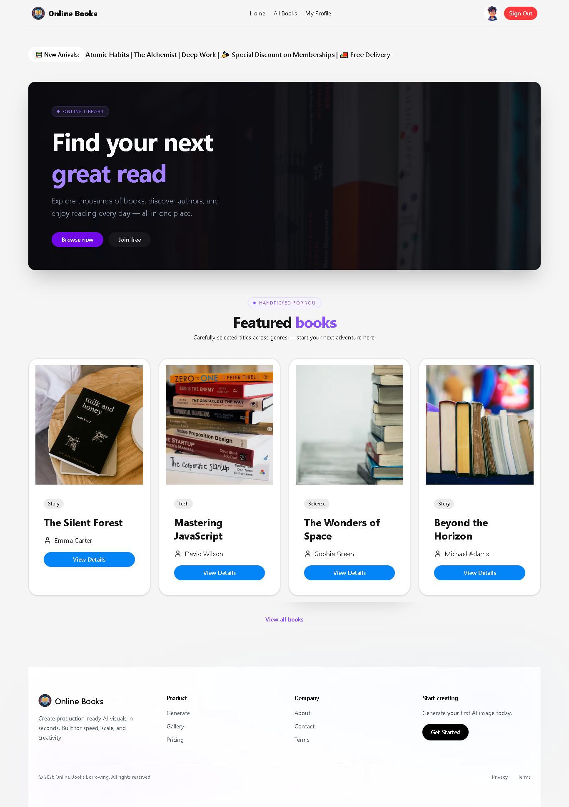
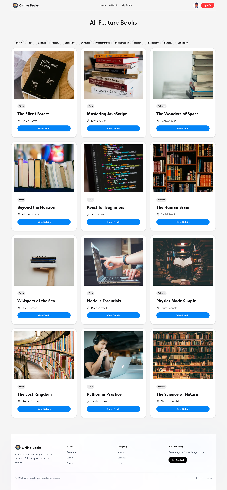

# 📚 Online Book Borrowing Platform

A full-stack web application where users can browse, borrow, and manage books online. Built with **Next.js 15**, **MongoDB**, **Better Auth**, and **Tailwind CSS**.


---

## 🌐 Live Demo

🔗 [https://online-book-borrowing-xi.vercel.app](https://online-book-borrowing-xi.vercel.app)
## gitHub repository Link: 🔗 https://github.com/mahdirafi/online-book-borrowing

---

## ✨ Features

- 🔐 **Authentication** — Email/password login & Google OAuth via Better Auth
- 📖 **Browse Books** — Explore a collection of available books
- 🔄 **Borrow & Return** — Borrow books and track return status
- 👤 **User Profile** — View and update personal profile
- 🛡️ **Protected Routes** — Secure pages for authenticated users only
- 📱 **Responsive Design** — Mobile-first UI with Tailwind CSS
- ⚡ **Fast Performance** — Built with Next.js App Router and Turbopack

---

## 🛠️ Tech Stack

| Category | Technology |
|---|---|
| Framework | Next.js 15 (App Router) |
| Language | JavaScript |
| Database | MongoDB Atlas |
| Authentication | Better Auth |
| Styling | Tailwind CSS v4 |
| Deployment | Vercel |

---

## 📁 Project Structure

```
online-book-borrowing/
├── app/
│   ├── (auth)/
│   │   ├── login/
│   │   └── register/
│   ├── api/
│   │   └── auth/
│   │       └── [...all]/
│   │           └── route.js
│   ├── books/
│   ├── profile/
│   ├── layout.js
│   └── page.js
├── components/
│   ├── Navbar.jsx
│   └── ...
├── lib/
│   ├── auth.js
│   └── auth-client.js
├── .env.local
└── package.json
```

---

## 🚀 Getting Started

### Prerequisites

- Node.js 18+
- MongoDB Atlas account
- Google OAuth credentials (optional)

### Installation

**1. Clone the repository**

```bash
git clone https://github.com/mahdirafi/online-book-borrowing.git
cd online-book-borrowing
```

**2. Install dependencies**

```bash
npm install
```

**3. Set up environment variables**

Create a `.env.local` file in the root directory:

```dotenv
# App
NEXT_PUBLIC_APP_URL=http://localhost:3000

# Better Auth
BETTER_AUTH_URL=http://localhost:3000
BETTER_AUTH_SECRET=your-random-secret-key

# MongoDB
MONGO_URI=your-mongodb-connection-string

# Google OAuth (optional)
GOOGLE_CLIENT_ID=your-google-client-id
GOOGLE_CLIENT_SECRET=your-google-client-secret
```

**4. Run the development server**

```bash
npm run dev
```

Open [http://localhost:3000](http://localhost:3000) in your browser.

---

## 🌍 Deployment on Vercel

**1.** Push your code to GitHub

**2.** Import the project on [Vercel](https://vercel.com)

**3.** Add the following environment variables in **Vercel Dashboard → Settings → Environment Variables**:

```
NEXT_PUBLIC_APP_URL=https://your-domain.vercel.app
BETTER_AUTH_URL=https://your-domain.vercel.app
BETTER_AUTH_SECRET=your-random-secret-key
MONGO_URI=your-mongodb-connection-string
GOOGLE_CLIENT_ID=your-google-client-id
GOOGLE_CLIENT_SECRET=your-google-client-secret
```

**4.** Deploy ✅

---

## 🔑 Environment Variables

| Variable | Description | Required |
|---|---|---|
| `NEXT_PUBLIC_APP_URL` | Public URL of the app (client-side) | ✅ |
| `BETTER_AUTH_URL` | Base URL for Better Auth | ✅ |
| `BETTER_AUTH_SECRET` | Secret key for Better Auth | ✅ |
| `MONGO_URI` | MongoDB connection string | ✅ |
| `GOOGLE_CLIENT_ID` | Google OAuth Client ID | ⚠️ Optional |
| `GOOGLE_CLIENT_SECRET` | Google OAuth Client Secret | ⚠️ Optional |

---

## 📸 Screenshots

> _Add screenshots of your app here_

---

## 🤝 Contributing

Contributions are welcome! Feel free to open an issue or submit a pull request.

1. Fork the project
2. Create your feature branch (`git checkout -b feature/amazing-feature`)
3. Commit your changes (`git commit -m 'Add some amazing feature'`)
4. Push to the branch (`git push origin feature/amazing-feature`)
5. Open a Pull Request

---

## 📄 License

This project is open source and available under the [MIT License](LICENSE).

---

## 👨‍💻 Author

**MD Mahdi** — [@mahdirafi](https://github.com/mahdirafi)

---

> Built with ❤️ using Next.js and Better Auth


